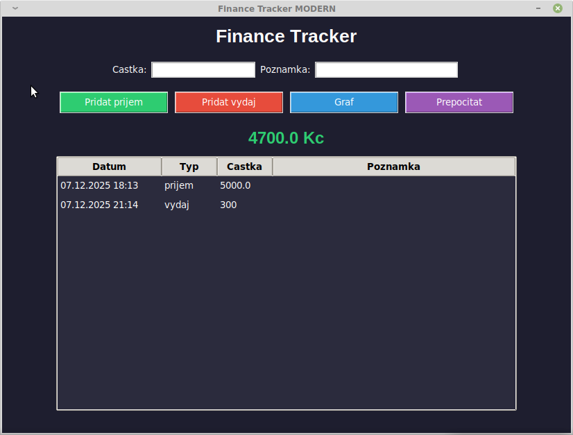
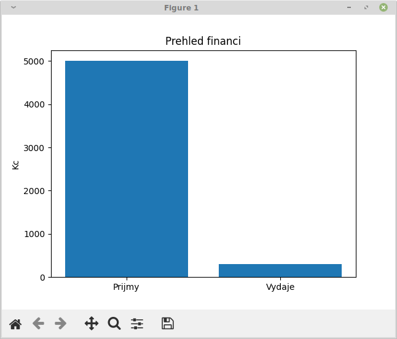

# 💰 Finance Tracker – historie verzí

**Python aplikace pro sledování financí**

---

## 🖼️ Screenshoty

### GUI


### Graf


---

## 🏷️ Verze

### 1️⃣ `tracker.py` – terminálová verze
* 💻 Zadávání příjmů a výdajů přes terminál
* 📄 Ukládání do CSV
* 📊 Výpočet zůstatku

### 2️⃣ `gui_tracker.py` – základní GUI
* 🖼️ Tkinter GUI
* ✏️ Zadávání příjmů/výdajů v okně
* 🔘 Tlačítka pro přidání, zůstatek a graf

### 3️⃣ `gui_tracker_pro.py` – profesionální layout
* 🎨 Lepší rozložení
* 🗂️ Oddělené panely pro vstup, tlačítka a zůstatek
* 🔹 Velká tlačítka, hezčí design

### 4️⃣ `gui_tracker_table.py` – tabulka záznamů
* 📋 Přehled všech záznamů v tabulce
* 🔄 Automatické obnovování tabulky
* 📊 Grafy a zůstatek v reálném čase

### 5️⃣ `gui_tracker_modern.py` – moderní styl
* 🌙 Tmavý režim
* 🎨 Barevná tlačítka
* 🖥️ Moderní vzhled a pohodlné GUI
* 📊 Tabulka + grafy + zůstatek

---

## 🚀 Spuštění

1. Stáhni repozitář
2. Ujisti se, že máš Python 3 a matplotlib (`sudo apt install python3-matplotlib`)
3. Spusť libovolnou verzi:

```bash
python3 gui_tracker_modern.py
