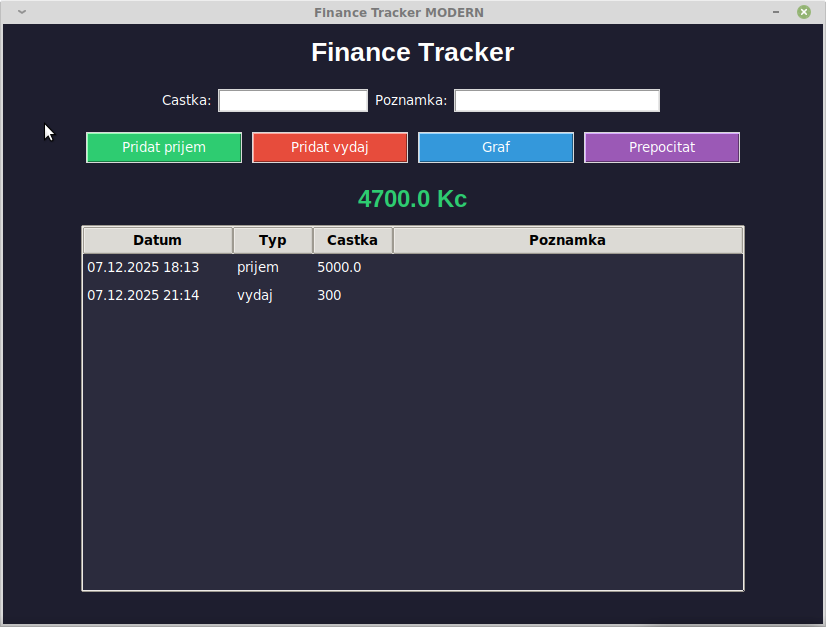
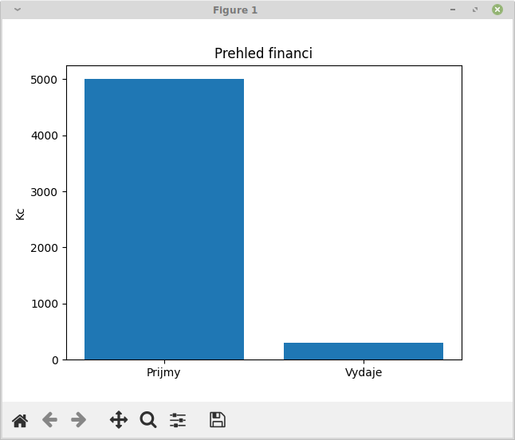

# Finance Tracker Pro


A Python desktop application for tracking personal finances. Built with Tkinter and Matplotlib, featuring a dark-mode GUI, transaction history table, and real-time charts.

---

## Features

- Add and categorize income and expenses
- View all transactions in a sortable table
- Real-time balance calculation
- Data visualization with charts (Matplotlib)
- Persistent storage via CSV
- Dark mode modern UI

---

## ️ Screenshots

### GUI


### Chart


---

## Getting Started

### Prerequisites

- Python 3.8+
- matplotlib

```bash
pip install matplotlib
```

### Installation

```bash
git clone https://github.com/Didinga/finance-tracker.git
cd finance-tracker
```

### Run

```bash
python gui_tracker_modern.py
```

---

## Project Structure & Version History

This project evolved through 5 versions, demonstrating progressive improvements in architecture and UI design:

| File | Version | Description |
|------|---------|-------------|
| `tracker.py` | v1 | CLI version - terminal input, CSV storage, balance calculation |
| `gui_tracker.py` | v2 | Basic Tkinter GUI with buttons for add, balance, and chart |
| `gui_tracker_pro.py` | v3 | Improved layout with separated panels and larger buttons |
| `gui_tracker_table.py` | v4 | Added transaction table with auto-refresh and real-time charts |
| `gui_tracker_modern.py` | v5 | Dark mode, colored buttons, modern design - **recommended** |

---

## ️ Tech Stack

- **Language:** Python 3
- **GUI:** Tkinter
- **Charts:** Matplotlib
- **Storage:** CSV

---

## License

This project is licensed under the MIT License.

---

## Author

**Didinga Omodi**
- GitHub: [@Didinga](https://github.com/Didinga)
- LinkedIn: [didiomodi](https://www.linkedin.com/in/didiomodi/)
